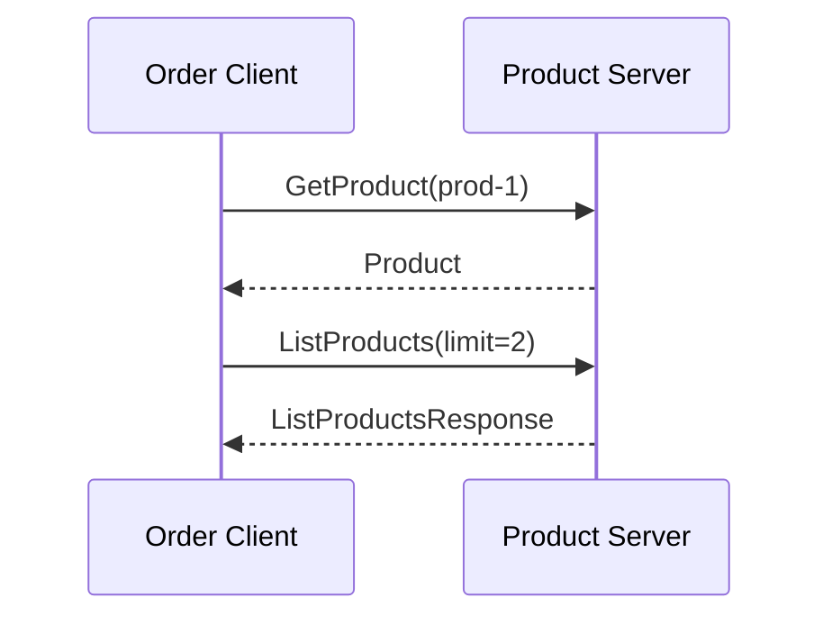

# gRPC API Integration

This document describes how the **Order service** (client) integrates with the **Product service** (server) via gRPC, and how **Uber FX** is used for dependency injection and lifecycle.

## Purpose

The repo simulates integration between two “APIs”:

1. **Product service** – gRPC server that exposes product data (in-memory store).
2. **Order service** – gRPC client that calls the Product API to get product details (e.g. before completing an order).

Communication is **contract-first** (Protocol Buffers) and **type-safe**, over HTTP/2 (gRPC).

## What is gRPC?

- **Contract-first**: API is defined in `.proto` files; server and client share the same messages and RPCs.
- **HTTP/2**: Multiplexing, binary protocol, low overhead.
- **Strong typing**: Generated code for each language; no manual JSON parsing.
- **Streaming**: Supports unary, server-streaming, client-streaming, and bidirectional RPCs (this demo uses unary only).

## Why FX?

- **Dependency injection**: Dependencies (config, gRPC server, client, product service) are provided via constructors; no global state.
- **Testability**: Constructors can be replaced or mocked in tests.
- **Lifecycle**: FX runs `OnStart` / `OnStop` hooks (e.g. start the gRPC listener and call `GracefulStop()` on shutdown).

## Architecture



**Components:**

- **Config** – `ServerAddr` (e.g. `:50051`) and `ClientTarget` (e.g. `localhost:50051`), supplied via `fx.Supply` in `main`.
- **Server FX module** – Provides `ProductService` (implements `ProductServiceServer`) and `*grpc.Server`; registers lifecycle to listen and `GracefulStop()`.
- **Client FX module** – Provides `*grpc.ClientConn` and `*client.Client`; optionally closes the connection in `OnStop`.

## Project layout

| Path | Role |
|------|------|
| `api/product/product.proto` | Product service and messages (GetProduct, ListProducts) |
| `internal/config` | Config struct; supplied to server and client |
| `internal/generated/product` | Generated Go (run `make generate`) |
| `internal/server` | Product service implementation + gRPC server constructor + FX module |
| `internal/client` | Client wrapper + connection constructor + FX module |
| `cmd/server` | Parses flags, builds config, runs FX app with server module |
| `cmd/client` | Parses flags, runs FX app with client module and `RunOrderDemo` |

## API contract

Defined in `api/product/product.proto`:

- **Product** – `id`, `name`, `description`, `price`
- **GetProduct(GetProductRequest) returns (Product)**
- **ListProducts(ListProductsRequest) returns (ListProductsResponse)** – returns repeated `Product` up to `limit`

## Flow

1. Start the Product server: `./bin/server -addr=:50051` (FX starts the gRPC listener in `OnStart`).
2. Run the Order client: `./bin/client -addr=localhost:50051`.
3. Client dials the server, calls `GetProduct("prod-1")` and `ListProducts(2)`, prints results, then shuts down via `fx.Shutdowner`.
4. Server keeps running until interrupted (e.g. Ctrl+C); FX runs `GracefulStop()` in `OnStop`.

## How to run

1. **Generate code** (required for full client/server behavior):
   ```bash
   make generate
   ```
   Requires `protoc`, `protoc-gen-go`, and `protoc-gen-go-grpc` (see [README](../README.md)).

2. **Start server** (one terminal):
   ```bash
   go build -o bin/server ./cmd/server && ./bin/server -addr=:50051
   ```

3. **Run client** (another terminal):
   ```bash
   go build -o bin/client ./cmd/client && ./bin/client -addr=localhost:50051
   ```

## Extending

- **New RPC or message**: Edit `api/product/product.proto`, run `make generate`, then implement the new RPC in `internal/server/server.go` and use it in `internal/client/client.go` and the demo.
- **New dependency**: Add a constructor (e.g. `NewFoo(cfg *config.Config) *Foo`) and register it with `fx.Provide` in the appropriate module (`server.Module` or `client.Module`).
