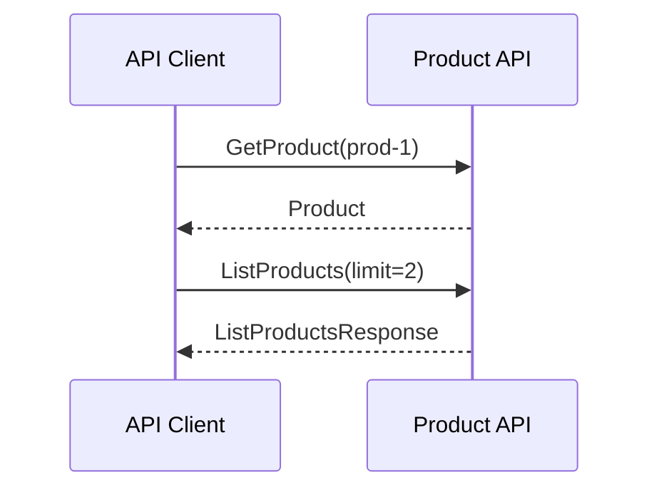

# gRPC Product API Integration

This document describes how the **Product API** is implemented via gRPC and grpc-gateway, and how **Uber FX** is used for dependency injection and lifecycle.

## Purpose

The repo implements a single **Product API**:

1. **Product service** – gRPC server that exposes product data (in-memory store) and is also exposed over HTTP/JSON via grpc-gateway.

Communication is **contract-first** (Protocol Buffers) and **type-safe**, over HTTP/2 (gRPC).

## What is gRPC?

- **Contract-first**: API is defined in `.proto` files; server and client share the same messages and RPCs.
- **HTTP/2**: Multiplexing, binary protocol, low overhead.
- **Strong typing**: Generated code for each language; no manual JSON parsing.
- **Streaming**: Supports unary, server-streaming, client-streaming, and bidirectional RPCs (this demo uses unary only).

## Why FX?

- **Dependency injection**: Dependencies (config, gRPC server, client, product service) are provided via constructors; no global state.
- **Testability**: Constructors can be replaced or mocked in tests.
- **Lifecycle**: FX runs `OnStart` / `OnStop` hooks (e.g. start the gRPC listener and call `GracefulStop()` on shutdown).

## Architecture



**Components:**

- **Config** – `ServerAddr` (e.g. `:50051`) and `HTTPGatewayAddr` (e.g. `:8080`), supplied via `fx.Supply` in `main`.
- **API FX module** – Provides `ProductService` (implements `ProductServiceServer`) and `*grpc.Server`; registers lifecycle to listen and `GracefulStop()`.

## Project layout

| Path | Role |
|------|------|
| `api/product/product.proto` | Product service and messages (GetProduct, ListProducts) |
| `internal/config` | Config struct; supplied to Product API and gateway |
| `internal/generated/product` | Generated Go (run `make generate`) |
| `internal/api` | Product service implementation + gRPC server constructor + FX module |
| `internal/gateway` | HTTP/JSON gateway that exposes the Product API over HTTP using grpc-gateway |
| `cmd/api` | Parses flags, builds config, runs FX app with API and gateway modules |

## API contract

Defined in `api/product/product.proto`:

- **Product** – `id`, `name`, `description`, `price`
- **GetProduct(GetProductRequest) returns (Product)**
- **ListProducts(ListProductsRequest) returns (ListProductsResponse)** – returns repeated `Product` up to `limit`

## Flow

1. Start the Product API: `./bin/api -addr=:50051 -http-addr=:8080` (FX starts the gRPC listener and HTTP gateway in `OnStart`).
2. An external client (curl, Postman, other services) calls `GetProduct("prod-1")` and `ListProducts(2)` over HTTP/JSON or gRPC.
3. The API keeps running until interrupted (e.g. Ctrl+C); FX runs `GracefulStop()` in `OnStop`.

## How to run

1. **Generate code**:
   ```bash
   make generate
   ```
   Requires `protoc`, `protoc-gen-go`, `protoc-gen-go-grpc`, and `protoc-gen-grpc-gateway` (see [README](../README.md)).

2. **Start Product API**:
   ```bash
   go build -o bin/api ./cmd/api && ./bin/api -addr=:50051 -http-addr=:8080
   ```

## Extending

- **New RPC or message**: Edit `api/product/product.proto`, run `make generate`, then implement the new RPC in `internal/api/product_service.go` and expose it via the gateway if needed.
- **New dependency**: Add a constructor (e.g. `NewFoo(cfg *config.Config) *Foo`) and register it with `fx.Provide` in the appropriate module (`api.Module` or `gateway.Module`).
